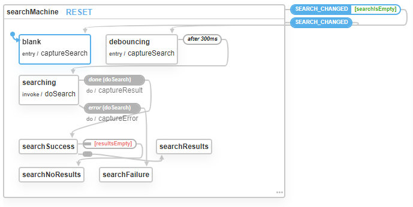

# Star Wars API Search

- Uses React 16.x and Xstate 4

[Xstate Visualizer](https://xstate.js.org/viz/?gist=f372e3732e2dd023a32988993685fb65)

👀 See the [Search state machine on the XState Visualizer](https://xstate.js.org/viz/?gist=f372e3732e2dd023a32988993685fb65)

